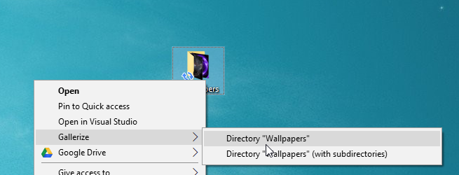
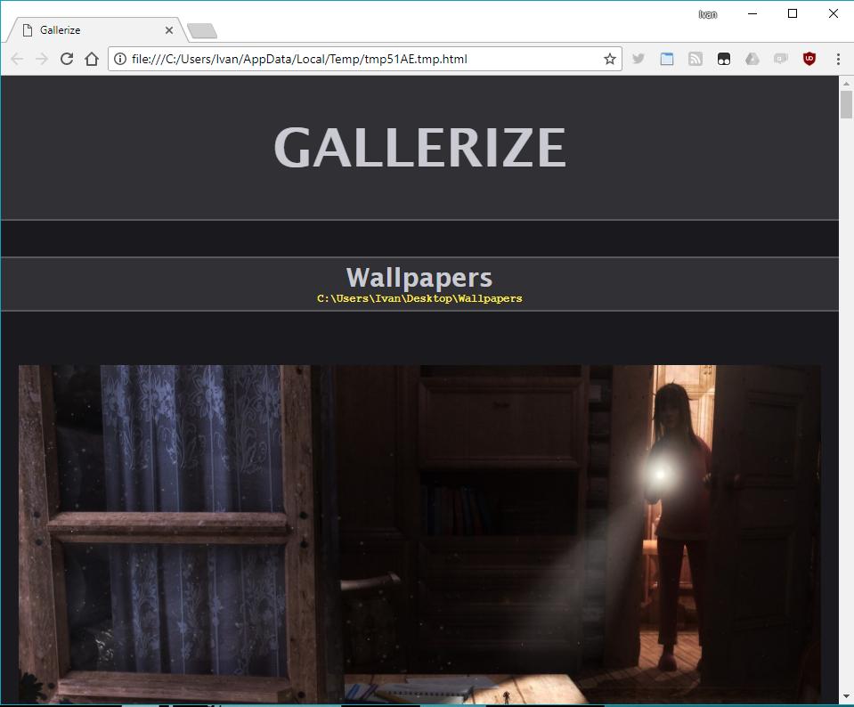

# Gallerize

Create a media gallery straight from Windows Explorer or desktop context menu.

Supported formats:
- Image files: JPG, JPEG, PNG, GIF, BMP
- Comic book archives: CBR, CBZ, CB7Z
- Archives: ZIP, 7Z, RAR

Archives are currently limited only to the files you select directly. Gallerize will not unpack archives that are inside directories you have selected.

### Usage:

1. Right click on any file or directory or selection of items. Select Gallerize and decide whether to include subdirectories.

    

2. An HTML image gallery opens in your default browser. Watch the images using browser UI instead of some desktop app.

    

That's it.

### Installation

Go to the [releases](https://github.com/panta82/gallerize/releases) page and download the latest release.

Unzip it.

Run Setup.exe.

You will need to approve admin rights in UAC prompt. This is because we need to install a "shell extension" that allows the right-click context menu you see on screenshots. The extension will be removed once you uninstall the program.

If installer asks you to kill Windows Explorer, you can do that using the Task Manager (Ctrl+Shift+Esc). To start it again later, right-click on Start Menu icon, select "Run", then enter "explorer" in the text box.

Tested on Windows 10.

### Release log

##### 1.3.0 (2018/06/30)
- Correctly sorts files using natural sort (so `chapter_1`, `chapter_11`, `chapter_2` are correctly sorted).

##### 1.2.0 (2018/05/10)
- Added support for archives and comic books (CBR/CBZ).

##### 1.1.0 (2018/05/03)
- First released version

### License

MIT
